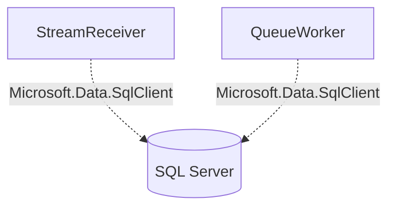
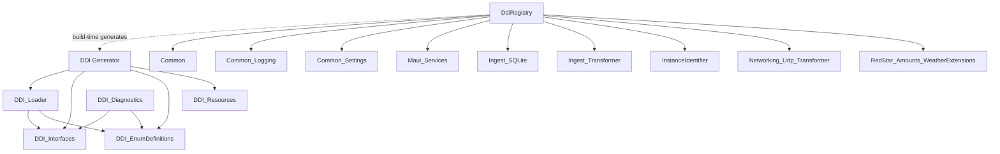

# Dependency Graph

> **Purpose**: Visualize project-to-project dependencies and catalog external NuGet packages.
>
> **Last updated**: After completing simplification proposals D1–D5, M1–M4, S3.

## Interactive DGML Diagram

For an interactive, zoomable, color-coded dependency graph, open [`DependencyGraph.dgml`](DependencyGraph.dgml) in Visual Studio Enterprise.

- **Double-click** to open in the DGML viewer
- **Layout > Top to Bottom** for best readability
- Nodes are color-coded by category (executable, contract, runtime, pipeline, persistence, DDI, server-side)

## MAUI App Dependency Tree

The MAUI app (`WeatherStationMaui`) has the deepest dependency tree in the solution, primarily through `DdiRegistry`.

```mermaid
graph TD
    MAUI[WeatherStationMaui]
    MAUI --> Common_Utility
    MAUI --> DdiRegistry
    MAUI --> Interfaces
    MAUI --> Maui_Services
    MAUI --> RedStar_Amounts

    DdiRegistry --> Common
    DdiRegistry --> Common_Logging
    DdiRegistry --> Common_Settings
    DdiRegistry --> Maui_Services
    DdiRegistry --> Ingest_SQLite
    DdiRegistry --> Ingest_Transformer
    DdiRegistry --> InstanceIdentifier
    DdiRegistry --> Networking_Udp_Transformer
    DdiRegistry --> RedStar_Amounts_WeatherExtensions

    Common --> Common_Utility
    Common --> Constants
    Common --> EventRelay
    Common --> Interfaces
    Common --> ServiceBase

    ServiceBase --> Common_Utility
    ServiceBase --> EnumDefinitions
    ServiceBase --> Interfaces

    Common_Logging --> Common
    Common_Logging --> Common_Utility
    Common_Logging --> Constants
    Common_Logging --> InstanceIdentifier
    Common_Logging --> Interfaces
    Common_Logging --> Persistence

    Common_Settings --> Common_Utility
    Common_Settings --> Constants
    Common_Settings --> EventRelay
    Common_Settings --> Interfaces
    Common_Settings --> Resource_Store

    Common_Metrics --> Common
    Common_Metrics --> Constants
    Common_Metrics --> EventRelay
    Common_Metrics --> Interfaces
    Common_Metrics --> ServiceBase

    Ingest_Transformer --> Common
    Ingest_Transformer --> Common_Utility
    Ingest_Transformer --> Constants
    Ingest_Transformer --> EnumDefinitions
    Ingest_Transformer --> Interfaces
    Ingest_Transformer --> IoT_UDP_Tempest
    Ingest_Transformer --> Models_Observables
    Ingest_Transformer --> RedStar_Amounts
    Ingest_Transformer --> RedStar_Amounts_StandardUnits

    Ingest_SQLite --> Common
    Ingest_SQLite --> Common_Metrics
    Ingest_SQLite --> Constants
    Ingest_SQLite --> EnumDefinitions
    Ingest_SQLite --> Ingest
    Ingest_SQLite --> Interfaces
    Ingest_SQLite --> Persistence
    Ingest_SQLite --> Resource_Store
    Ingest_SQLite --> InstanceIdentifier

    Networking_Udp_Transformer --> Common
    Networking_Udp_Transformer --> Common_Utility
    Networking_Udp_Transformer --> Constants
    Networking_Udp_Transformer --> Interfaces
    Networking_Udp_Transformer --> IoT_UDP_Tempest

    Persistence --> Data_Sqlite
    Persistence --> InstanceIdentifier
    Persistence --> Interfaces
    Persistence --> Resource_Store

    Data_Sqlite --> Common_Utility
    Data_Sqlite --> Constants
    Data_Sqlite --> Interfaces

    EventRelay --> Interfaces
    Maui_Services --> Constants
    Maui_Services --> Interfaces
    IoT_UDP_Tempest --> Common_Utility
    IoT_UDP_Tempest --> Interfaces
    Common_Utility --> Interfaces
    Models_Observables --> Interfaces
    RedStar_Amounts_WeatherExtensions --> RedStar_Amounts
    RedStar_Amounts_WeatherExtensions --> RedStar_Amounts_StandardUnits

    InstanceIdentifier --> Interfaces
    InstanceIdentifier --> Constants

    Resource_Store

    Constants --> EnumDefinitions
    Constants --> RedStar_Amounts
    Constants --> RedStar_Amounts_StandardUnits
    EnumDefinitions --> RedStar_Amounts
    Interfaces --> EnumDefinitions
    Interfaces --> RedStar_Amounts
    Ingest --> EnumDefinitions
    RedStar_Amounts_StandardUnits --> RedStar_Amounts
```

## Standalone Executables

No project references. Completely isolated from the MAUI dependency tree.

## DDI Toolchain

## NuGet Package Catalog

### Runtime Packages (MAUI App Tree)

| Package | Consumer(s) | Purpose |
|---------|------------|---------|
| `Microsoft.Maui.Controls` | MAUI App | MAUI UI framework |
| `CommunityToolkit.Maui` | MAUI App | MAUI UI helpers |
| `CommunityToolkit.Mvvm` | EventRelay | WeakReferenceMessenger |
| `SkiaSharp` | MAUI App | 2D graphics |
| `LiveChartsCore.SkiaSharpView.Maui` | MAUI App | Charting |
| `Serilog` | Common_Logging | Structured logging |
| `Serilog.Sinks.File` | Common_Logging | File log sink |
| `YamlDotNet` | Common_Utility, Common_Settings, InstanceIdentifier | YAML parsing |
| `JsonSchema.Net` | Interfaces | JSON schema validation |
| `System.Net.Http.Json` | Common | HTTP JSON helpers |
| `Microsoft.Maui.Essentials` | Maui_Services | Device APIs |
| `Microsoft.Data.Sqlite` | Data_Sqlite | SQLite ADO.NET provider |

### Server-Side Packages

| Package | Consumer(s) | Purpose |
|---------|------------|---------|
| `Microsoft.Data.SqlClient` | StreamReceiver, QueueWorker | SQL Server ADO.NET |

### DDI Toolchain Packages

| Package | Consumer(s) | Purpose |
|---------|------------|---------|
| `Handlebars.Net` | DDI Generator | Template rendering |
| `System.Reflection.MetadataLoadContext` | DDI Generator | Reflection-only assembly loading |
| `YamlDotNet` | DDI Loader | YAML parsing |

### Test Packages

| Package | Consumer(s) | Purpose |
|---------|------------|---------|
| `xunit` | DDI Loader Tests | Test framework |
| `xunit.runner.visualstudio` | DDI Loader Tests | VS test adapter |
| `Microsoft.NET.Test.Sdk` | DDI Loader Tests | Test SDK |

## Changes from Original Graph

The following edges were **removed** during the simplification work:

| Removed Edge | Reason |
|-------------|--------|
| `InstanceIdentifier → Common_Settings` | D4: dead reference removed |
| `Common_Settings → Data_Sqlite` | M3: SqliteDatabaseOptionsFactory moved to Data_Sqlite |
| `Resource_Store → Common` | D5: dead reference removed |

The following **nodes were added**:

| New Node | Reason |
|----------|--------|
| `ServiceBase` | M1: ServiceBase + provenance types extracted from Common |
| `Common_Metrics` (populated) | M2: Metrics files moved from Common to Common_Metrics |

The following **packages were removed**:

| Removed Package | From | Reason |
|----------------|------|--------|
| `Npgsql` | Common | D1: dead reference |
| `Npgsql` | Common_Logging | D2: dead reference |
| `Microsoft.Maui.Controls` | Common_Settings | D3: dead reference + dead `#if MAUI` code |
