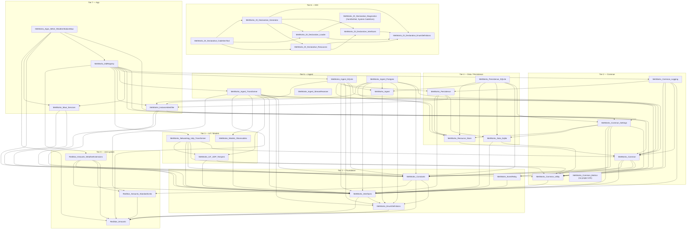

# Solution Architecture

This document maps the current single-solution architecture for the WeatherStation MAUI application. It covers all 38 projects, their tier groupings, dependency relationships, NuGet packages, and known layering concerns.

See also:
- Multi-solution evaluation: `MULTI_SOLUTION_EVALUATION.md`
- Dependency cleanup proposals: `DEPENDENCY_CLEANUP.md`
- Interface inventory: `INTERFACE_CATALOG.md`
- DDI framework conventions: `DI_AND_INITIALIZEASYNC.md`

---

## Solution file

`MetWorks_Apps_MAUI_Solutions_WeatherStationMaui.slnx` — a single `.slnx` (Visual Studio solution) containing all 38 projects.

---

## Tier overview

Projects are organized conceptually into eight tiers. Build order follows the tiers (lower tiers compile first).

| Tier | Purpose | Project count |
|------|---------|:---:|
| **0 — Unit system** | RedStar.Amounts quantity/unit library | 3 |
| **1 — Foundation** | Interfaces, enums, constants, event relay | 4 |
| **2 — Common** | Cross-cutting utilities, settings, logging, metrics | 5 |
| **3 — IoT / Data models** | UDP device support, observable models | 3 |
| **4 — Data / Persistence** | SQLite access, persistence, resource store | 4 |
| **5 — Ingest** | Raw packet ingest, transformation, stream receiver | 5 |
| **6 — DDI framework** | Declarative DI loader, generator, code-gen tool | 7 |
| **7 — App** | MAUI app, service registry, MAUI services | 3 |
| **Tests** | Unit and integration test projects | 5 |

---

## Project catalogue

### Tier 0 — Unit system

| Project | Namespace | Description |
|---------|-----------|-------------|
| `RedStar_Amounts` | `RedStar.Amounts` | Core `Amount` / `Unit` quantity type; no external dependencies |
| `RedStar_Amounts_StandardUnits` | `RedStar.Amounts.StandardUnits` | SI and common units (temperature, pressure, speed, length, …) |
| `RedStar_Amounts_WeatherExtensions` | `RedStar.Amounts.WeatherExtensions` | Weather aliases: mph, Fahrenheit, inHg |

### Tier 1 — Foundation

| Project | Namespace | Description |
|---------|-----------|-------------|
| `MetWorks_EnumDefinitions` | `MetWorks.EnumDefinitions` | Shared enumerations (`PacketEnum`: Wind, Lightning, Observation, Precipitation) |
| `MetWorks_Constants` | `MetWorks.Constants` | Constants, `SettingConstants`, `LookupDictionaries` |
| `MetWorks_Interfaces` | `MetWorks.Interfaces` | 40+ shared interfaces — the primary DI boundary between all projects |
| `MetWorks_EventRelay` | `MetWorks.EventRelay` | Pub/sub event bus (`EventRelayBasic`, `EventRelayPath`) wrapping `CommunityToolkit.Mvvm` |

### Tier 2 — Common

| Project | Namespace | Description |
|---------|-----------|-------------|
| `MetWorks_Common_Utility` | `MetWorks.Common.Utility` | Generic utilities; YAML helpers |
| `MetWorks_Common_Settings` | `MetWorks.Common.Settings` | Settings YAML loader, `SettingRepository`, `SettingProvider` |
| `MetWorks_Common` | `MetWorks.Common` | Core services: `ServiceBase`, `TempestRestClient`, `StationMetadataProvider`, `TempestForecastProvider`, provenance types |
| `MetWorks_Common_Logging` | `MetWorks.Common.Logging` | Logging stack: `LoggerStub`, `ContextualLogger`, `LoggerFile`, `LoggerResilient`, `LoggerSQLite` |
| `MetWorks_Common_Metrics` | `MetWorks.Common.Metrics` | Metrics aggregation (no external project dependencies) |

### Tier 3 — IoT / Data models

| Project | Namespace | Description |
|---------|-----------|-------------|
| `MetWorks_IoT_UDP_Tempest` | `MetWorks.IoT.UDP.Tempest` | Tempest UDP device: DTO types, `PacketFactory`, `RawPacketRecordTypedFactory` |
| `MetWorks_Networking_Udp_Transformer` | `MetWorks.Networking.UDP.Transformer` | UDP listener → publishes `IRawPacketRecordTyped` via event relay |
| `MetWorks_Models_Observables` | `MetWorks.Models.Observables` | Observable domain models; provenance support |

### Tier 4 — Data / Persistence

| Project | Namespace | Description |
|---------|-----------|-------------|
| `MetWorks_Data_Sqlite` | `MetWorks.Data.Sqlite` | Low-level SQLite access layer (target destination for SQLite code, see `DEPENDENCY_CLEANUP.md`) |
| `MetWorks_Resource_Store` | `MetWorks.Resource.Store` | Embedded SQL schema files and `settings.yaml` resource bundle |
| `MetWorks_Persistence` | `MetWorks.Persistence` | Persistence coordinator: `SqliteBootstrapper`, `SqliteSchemaBootstrapper` |
| `MetWorks_Persistence_SQLite` | `MetWorks.Persistence.SQLite` | **Legacy** SQLite persistence (being migrated into `MetWorks_Data_Sqlite` + `MetWorks_Persistence`; see `DEPENDENCY_CLEANUP.md`) |

### Tier 5 — Ingest

| Project | Namespace | Description |
|---------|-----------|-------------|
| `MetWorks_Ingest` | `MetWorks.Ingest` | Base ingest types (`UdpPacketTableData`) |
| `MetWorks_Ingest_Transformer` | `MetWorks.Ingest.Transformer` | `SensorReadingTransformer`: converts `IRawPacketRecordTyped` → typed domain readings |
| `MetWorks_Ingest_SQLite` | `MetWorks.Ingest.SQLite` | SQLite-based packet ingest with rollups and stream shipping |
| `MetWorks_Ingest_Postgres` | `MetWorks.Ingest.Postgres` | PostgreSQL ingest: `RawPacketIngestor`, `StationMetadataIngestor` |
| `MetWorks_Ingest_StreamReceiver` | `MetWorks.Ingest.StreamReceiver` | ASP.NET Core web receiver for stream shipping |

### Tier 6 — DDI framework

| Project | Namespace | Description |
|---------|-----------|-------------|
| `MetWorks_DI_Declarative_EnumDefinitions` | `MetWorks.DI.Declarative.EnumDefinitions` | Template-specific enumerations |
| `MetWorks_DI_Declarative_Interfaces` | `MetWorks.DI.Declarative.Interfaces` | Framework interfaces for DDI |
| `MetWorks_DI_Declarative_Diagnostics` | `MetWorks.DI.Declarative.Diagnostics` | Error reporting and diagnostics |
| `MetWorks_DI_Declarative_Loader` | `MetWorks.DI.Declarative.Loader` | YAML input parser |
| `MetWorks_DI_Declarative_Resources` | `MetWorks.DI.Declarative.Resources` | Handlebars code-generation templates |
| `MetWorks_DI_Declarative_Generator` | `MetWorks.DI.Declarative.Generator` | C# code generator (uses `Handlebars.Net`, `MetadataLoadContext`) |
| `MetWorks_DI_Declarative_CodeGenTool` | _(CLI tool)_ | `dotnet run` entry point for code generation |

### Tier 7 — App

| Project | Namespace | Description |
|---------|-----------|-------------|
| `MetWorks_InstanceIdentifier` | `MetWorks.InstanceIdentifier` | Installation-scoped GUID (`IInstanceIdentifier`) persisted via settings |
| `MetWorks_Maui_Services` | `MetWorks.Maui.Services` | Platform-specific MAUI services; depends on `Microsoft.Maui.Essentials` |
| `MetWorks_DdiRegistry` | `MetWorks.ServiceRegistry` | **Generated** DDI registry — aggregates all Tier 2–5 services; rebuilt by MSBuild from `WeatherStationMaui.yaml` |
| `MetWorks_Apps_MAUI_WeatherStationMaui` | `MetWorks.Apps.MAUI.WeatherStationMaui` | Main MAUI application (Android primary, Windows secondary); host/guest page architecture |

### Tests

| Project | Tier under test |
|---------|----------------|
| `MetWorks_Common_Logging.Tests` (src/tests) | Common.Logging |
| `MetWorks.Common.Logging.Tests` (src/) | Common.Logging |
| `MetWorks.Common.Settings.Tests` | Common.Settings |
| `MetWorks.Common.Tests` | Common, EventRelay |
| `MetWorks_DI_Declarative_Loader_Tests` | DDI Loader, Generator |

---

## Dependency graph

The diagram below shows project-to-project references. NuGet packages are omitted for clarity. Arrows point from dependent to dependency.



---

## NuGet packages by tier

### Tier 0 — Unit system
_(no NuGet packages)_

### Tier 1 — Foundation
| Package | Version | Project |
|---------|---------|---------|
| `CommunityToolkit.Mvvm` | 8.4.0 | MetWorks_EventRelay |
| `JsonSchema.Net` | 8.0.3 | MetWorks_Interfaces |

### Tier 2 — Common
| Package | Version | Project |
|---------|---------|---------|
| `YamlDotNet` | 12.0.0 | MetWorks_Common_Utility, MetWorks_Common_Settings |
| `Microsoft.Maui.Controls` | 10.0.0 | MetWorks_Common_Settings ⚠️ |
| `Microsoft.Data.Sqlite` | 10.0.2 | MetWorks_Data_Sqlite |
| `System.Net.Http.Json` | 10.0.0 | MetWorks_Common |
| `Npgsql` | 10.0.1 | MetWorks_Common ⚠️, MetWorks_Common_Logging |
| `Serilog` | 4.3.0 | MetWorks_Common_Logging |
| `Serilog.Sinks.File` | 7.0.0 | MetWorks_Common_Logging |

### Tier 5 — Ingest
| Package | Version | Project |
|---------|---------|---------|
| `Dapper` | 2.1.66 | MetWorks_Ingest_Postgres |
| `Npgsql` | 10.0.1 | MetWorks_Ingest_Postgres |

### Tier 6 — DDI
| Package | Version | Project |
|---------|---------|---------|
| `YamlDotNet` | 12.0.0 | MetWorks_DI_Declarative_Diagnostics, MetWorks_DI_Declarative_Loader |
| `System.CodeDom` | 10.0.0 | MetWorks_DI_Declarative_Diagnostics, MetWorks_DI_Declarative_Loader |
| `Handlebars.Net` | 2.1.6 | MetWorks_DI_Declarative_Generator |
| `System.Reflection.MetadataLoadContext` | 8.0.0 | MetWorks_DI_Declarative_Generator |

### Tier 7 — App
| Package | Version | Project |
|---------|---------|---------|
| `YamlDotNet` | 12.0.0 | MetWorks_InstanceIdentifier |
| `Microsoft.Maui.Essentials` | 10.0.0 | MetWorks_Maui_Services |
| `Microsoft.Maui.Controls` | 10.0.0 | MetWorks_Apps_MAUI_WeatherStationMaui |
| `Microsoft.Extensions.Logging.Debug` | 9.0.0-preview | MetWorks_Apps_MAUI_WeatherStationMaui |
| `Microsoft.Extensions.Configuration` | 10.0.0 | MetWorks_Apps_MAUI_WeatherStationMaui |
| `System.Reactive` | 7.0.0-preview | MetWorks_Apps_MAUI_WeatherStationMaui |

---

## Known layering concerns

These are cross-tier references that should be addressed as part of dependency cleanup (details in `DEPENDENCY_CLEANUP.md`).

| # | Concern | From | To | Impact |
|---|---------|------|----|--------|
| L1 | `MetWorks_Common` depends on `Npgsql` | Tier 2 | Postgres driver | Common library pulls in PostgreSQL driver; prevents use in non-Postgres environments without extra trimming |
| L2 | `MetWorks_Common_Settings` depends on `Microsoft.Maui.Controls` | Tier 2 | MAUI framework | Settings library cannot be used in non-MAUI projects (e.g., server, tests) without the MAUI workload |
| L3 | `MetWorks_Common_Settings` depends on `MetWorks_Data_Sqlite` | Tier 2 | Tier 4 | Settings loading reaches down into the data layer; proper layering would have settings use an abstraction |
| L4 | `MetWorks_Common_Logging` depends on `MetWorks_Persistence` | Tier 2 | Tier 4 | Logging depends on persistence; should be the reverse (persistence can use logging, not vice versa) |
| L5 | `MetWorks_Resource_Store` depends on `MetWorks_Common` | Tier 4 | Tier 2 | Resource store (embedded files) should have minimal deps; depending on the full Common project pulls in Npgsql transitively |
| L6 | `MetWorks_Common_Logging` depends on `Npgsql` + Serilog PostgreSQL sinks | Tier 2 | Postgres driver | Same impact as L1; PostgreSQL logging should be in a separate optional package |

---

## Data flow summary

For runtime data flow (UDP → EventRelay → UI/Persistence), see `ARCHITECTURE.md` and `MessageChain.md`.

```
UDP broadcast
  └─▶ MetWorks_Networking_Udp_Transformer  (resilient UDP listener)
        └─▶ IEventRelayBasic.Publish(IRawPacketRecordTyped)
              ├─▶ MetWorks_Ingest_Transformer  (SensorReadingTransformer)
              │     └─▶ IEventRelayBasic.Publish(IObservationReading | IWindReading | …)
              │           ├─▶ WeatherViewModel  (MAUI UI)
              │           └─▶ MetWorks_Ingest_SQLite  (SQLite persistence + rollups)
              └─▶ MetWorks_Ingest_Postgres  (optional PostgreSQL persistence)
```

All wiring is declared in `WeatherStationMaui.yaml` and instantiated by the generated `MetWorks_DdiRegistry` at startup.
