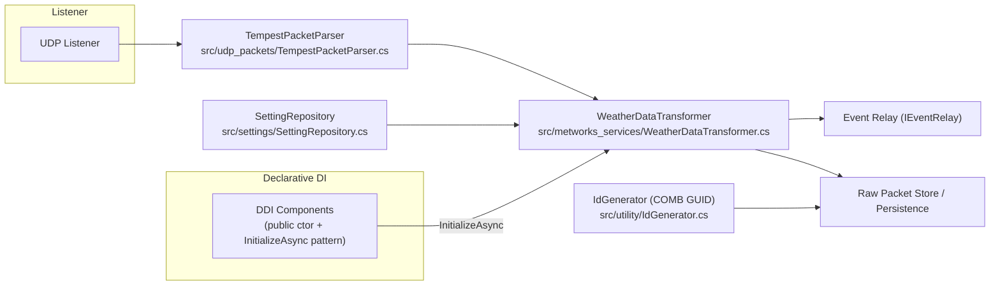

# ARCHITECTURE

This document is the authoritative developer-facing architecture overview for the WeatherStation MAUI service.

Key references
- COMB GUID implementation: src/utility/IdGenerator.cs
- Packet parsing: src/udp_packets/TempestPacketParser.cs
- Transformation & last-packet cache: src/metworks_services/WeatherDataTransformer.cs
- Settings entrypoint: src/settings/SettingRepository.cs

Core concepts
- UDP Listener receives raw packets, TempestPacketParser parses them into typed packets, WeatherDataTransformer applies business transforms and maintains a last-packet cache for retransforms; transformed events are published via the Event Relay and persisted as configured.
- Declarative DI components are constructed with a public parameterless constructor and receive runtime dependencies via InitializeAsync (documented in DI_AND_INITIALIZEASYNC.md).

### Transform provenance & flow
1. UDP Listener -> raw packet
2. TempestPacketParser -> typed packet
3. WeatherDataTransformer -> normalize, enrich, cache last-packet, produce domain events
4. Event Relay -> downstream consumers (UI, persistence, analytics)

### COMB GUID
IdGenerator produces COMB GUIDs (GUIDs with time component) used for deterministic ordering of packet records; see src/utility/IdGenerator.cs for implementation and tests.

### Diagram

Provenance: every transformed record should carry the original packet metadata (timestamp, source endpoint, raw payload id) and the COMB GUID to enable deterministic reordering and replay.
